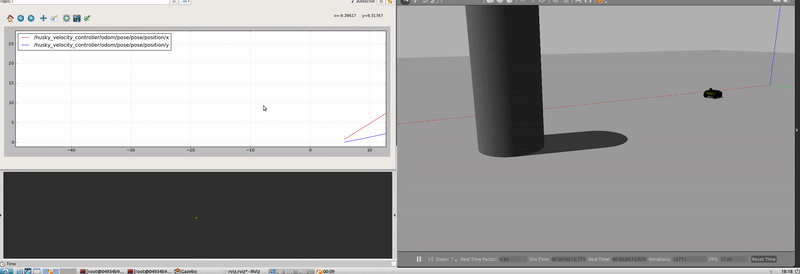

# Husky High-Level Controller

This is a simulation of Husky using ROS, Gazebo, and RViz for Udacity C++ Software Engineer Nanodegree Capstone Project. 
I chose this ND because I wanted to improve my C++ skills to become a better roboticist.
So for my capstone project, I decided to create a ROS Package.

## Objective 
The idea is derived from the [ETH Zurich Programming for Robotics - ROS course](https://rsl.ethz.ch/education-students/lectures/ros.html)

The initial goal of the exercises was to drive Husky towards the pillar on the map using a simple proportional controller based on the only obstacle detected by the robot and adjusting its heading accordingly.
A detailed explanation of the exercise can be found [here](https://ethz.ch/content/dam/ethz/special-interest/mavt/robotics-n-intelligent-systems/rsl-dam/ROS2020/Exercise%20Session%203.pdf).

To make my work unique, I extrapolated the exercise requirement and instead of colliding the robot against the pillar, now it enters a circular trajectory around it.
This is accomplished by segmenting the control routine into two parts. The robot is always driving forward, but in the first part, it aims at the pillar.
When it gets closer, the angular velocity command is obtained by the sum of a feedforward component that sends Husky on a circle around the pillar and a proportional feedback component responsible for making sure the robot remains at the desired distance from the obstacle during the trajectory.

The radius of the trajectory, as well as other parameters, can be configured at `husky_high_level_controller/config/params.yaml`

The gif below demonstrates the resultant behavior. The right side of the screen shows the simulation running on Gazebo. On the top left corner, the robot's x and y positions are being plotted, right below it, RViz displays the robot model, some TFs, the laser scan, and a marker that denotes the obstacle point that is closest to Husky. 



## Dependencies for Running Locally - Linux Only
* cmake >= 2.8
  * [click here for installation instructions](https://cmake.org/install/)
* make >= 4.1 (Linux, Mac), 3.81 (Windows)
  * make is installed by default on most Linux distros
* gcc/g++ >= 5.4
  * gcc / g++ is installed by default on most Linux distros
* catkin_tools = latest version
  * [Click here for installation instructions](https://catkin-tools.readthedocs.io/en/latest/installing.html)
* python2
  * There is a compatibility issue with python3, so one has to use python2 to run this project. To install, on your terminal, type 
  ``` sh
  $ sudo apt install python2

## Ubuntu - setup ROS & Gazebo:
The package has been tested on ROS Kinetic and Gazebo 7.0 on Ubuntu 16.04. [Click here for installation instructions](http://wiki.ros.org/kinetic/Installation/Ubuntu). Select the Desktop-Full Install Repository.

## Husky - setup the robot packages:
For the simulation, a Husky package is required [Click here for the installation instructions](http://wiki.ros.org/husky_gazebo/Tutorials/Simulating%20Husky).

Here are the commands you will need to execute to avoid problems in the installation process.

``` sh
$ sudo apt-key del 421C365BD9FF1F717815A3895523BAEEB01FA116`
$ sudo -E apt-key adv --keyserver 'hkp://keyserver.ubuntu.com:80' --recv-key C1CF6E31E6BADE8868B172B4F42ED6FBAB17C654`
$ sudo apt clean && sudo apt update`
$ sudo apt-get update && apt-get upgrade`
$ sudo apt-get install ros-kinetic-husky-simulator`
```
## How to Launch the simulation?

If you just installed ROS from apt on Ubuntu then you will have setup .*sh files in '/opt/ros/<distro>/', and you then source them this way: 
``` sh
$ source /opt/ros/<distro>/setup.bash 
```
  
#### Create a catkin_ws
```sh
$ cd /home/workspace/
$ mkdir -p /home/workspace/catkin_ws/src/
$ cd catkin_ws/src/
$ catkin_init_workspace
$ cd ..
```

#### Clone the package in catkin_ws/src/
```sh
$ cd /home/workspace/catkin_ws/src/
$ git clone https://github.com/TheodoroCardoso/husky-high-level-controller.git
```

#### Build the packages
```sh
$ cd /home/workspace/catkin_ws/ 
$ catkin_make
```
 
#### Now change the python --version to avoid bugs
```sh
$ sudo apt-get -y install python-rospkg
$ export PYTHONPATH=$PYTHONPATH:/usr/lib/python2.7/dist-packages
$ sudo apt-get install virtualenv
$ virtualenv -p /usr/bin/python2.7 --distribute temp-python
$ source temp-python/bin/activate
```
 
#### Once packages have been built and the environment setup, you can launch the simulation!
```sh
$ roslaunch husky_high_level_controller husky_pillar.launch
```

## Project Specification

### README (All Rubric Points REQUIRED)

| _Done_  	| _Criteria_                                                           	| _Meets Specifications_                                                                                                                                                                                                                                                           	            |
|:-------:	|:---------------------------------------------------------------------	|:---------------------------------------------------------------------------------------------------------------------------------------------------------------------------------------------------------------------------------------------------------------------------------------------	|         
| &#9745; 	| A `README` with instructions is included with the project            	| The README is included with the project and has instructions for building/running the project. <br><br>If any additional libraries are needed to run the project, these are indicated with cross-platform installation instructions.<br><br>You can submit your writeup as markdown or pdf. 	|
| &#9745; 	| The `README` indicates which project is chosen.                      	| The `README` describes the project you have built.<br><br>The `README` also indicates the file and class structure, along with the expected behavior or output of the program.                                                                                                        	    |
| &#9745; 	| The `README` includes information about each rubric point addressed. 	| The `README` indicates which rubric points are addressed. The `README` also indicates where in the code (i.e. files and line numbers) that the rubric points are addressed.                                                                                                      	            |


### Compiling and Testing (All Rubric Points REQUIRED)

| _Done_  	| _Criteria_                           	| _Meets Specifications_                                                                                                                                                                                                         	|
|:-------:	|:-------------------------------------	|:-------------------------------------------------------------------------------------------------------------------------------------------------------------------------------------------------------------------------------	|
| &#9745; 	| The submission must compile and run. 	| The project code must compile and run without errors.  We strongly recommend using  `cmake` and  `make`, as provided in the starter repos. If you choose another build system, the code must compile on any reviewer platform. 	|


### Loops, Functions, I/O

| _Done_  	| _Criteria_                                                                                     	| _Meets Specifications_                                                                                                   	| 
|:-------:	|:-----------------------------------------------------------------------------------------------	|:-------------------------------------------------------------------------------------------------------------------------	|
| &#9745; 	| The project demonstrates an understanding of C++ functions and control structures.             	| A variety of control structures are used in the project.<br><br>The project code is clearly organized into functions.     | 
| &#9745; 	| The project reads data from a file and process the data, or the program writes data to a file. 	| The project reads data from an external file or writes data to a file as part of the necessary operation of the program. 	|                                                                                                                                                                                                                                                                                                                                                                                                                                                                                                                                                                                                                                                                                                                                                                                                                                                                                                                                                                                                                                                                                                                                                                                                                                                                                                                                                                                                                                                                                                                                                                                


### Object Oriented Programming

| _Done_  	| _Criteria_                                                                       	| _Meets Specifications_                                                                                                                                                                       	| 
|:-------:	|:---------------------------------------------------------------------------------	|:---------------------------------------------------------------------------------------------------------------------------------------------------------------------------------------------	|
| &#9745; 	| The project uses Object Oriented Programming techniques.                         	| The project code is organized into classes with class attributes to hold the data, and class methods to perform tasks.                                                                       	|
| &#9745; 	| Classes use appropriate access specifiers for class members.                     	| All class data members are explicitly specified as public, protected, or private.                                                                                                            	| 
| &#9745; 	| Class constructors utilize member initialization lists.                          	| All class members that are set to argument values are initialized through member initialization lists.                                                                                       	|


### Memory Management

| _Done_  	| _Criteria_                                                                       	| _Meets Specifications_                                                                                                                                                                       	| 
|:-------:	|:---------------------------------------------------------------------------------	|:---------------------------------------------------------------------------------------------------------------------------------------------------------------------------------------------	|
| &#9745; 	| The project makes use of references in function declarations.                             	| At least two variables are defined as references, or two functions use pass-by-reference in the project code.  | 

